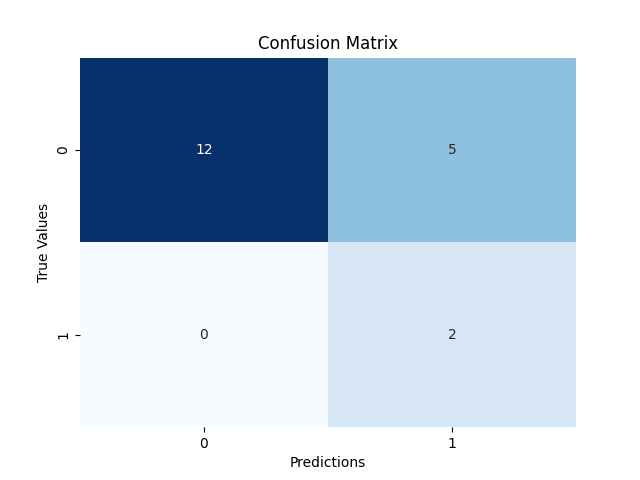
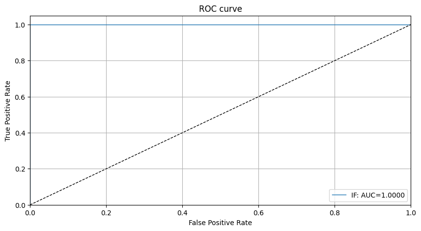
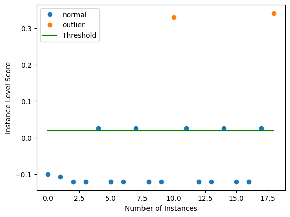

# Isolation Forest outlier detection on URLs 

In the context of our project on URL detection, Isolation Forests prove to be particularly effective. Given the diverse and dynamic nature of URLs, this method excels at identifying unusual patterns and isolating potentially malicious or anomalous URLs. By leveraging the inherent ability of Isolation Forests to efficiently detect outliers through random feature selections, our project benefits from a robust and adaptable approach to URL anomaly detection. The application of Isolation Forests aligns with the unique challenges posed by URL datasets, allowing for accurate and efficient identification of suspicious URLs in a variety of contexts. 

## Data

### Test Set

The Isolation Forest algorithm was applied to a specific test set comprising URLs. This dataset encompasses a diverse range of URLs, including both normal and potentially anomalous instances. The effectiveness of the Isolation Forest method in detecting outliers is evaluated based on this test set.

|   numDots |   subdomainLevel |   pathLevel |   urlLength |   numDash |   numUnderscore |   numPercent |   numQueryComponents |   numApersand |   numDigits | https   | ipAddress   |   hostnameLength |   pathLength |   queryLength |   type |
|----------:|-----------------:|------------:|------------:|----------:|----------------:|-------------:|---------------------:|--------------:|------------:|:--------|:------------|-----------------:|-------------:|--------------:|-------:|
|         2 |                1 |           0 |          17 |         0 |               0 |            0 |                    0 |             0 |           0 | True    | False       |                9 |            0 |             0 |      0 |
|         2 |                1 |           0 |          22 |         0 |               0 |            0 |                    0 |             0 |           0 | True    | False       |               14 |            0 |             0 |      0 |
|         1 |                0 |           0 |          19 |         0 |               0 |            0 |                    0 |             0 |           0 | True    | False       |               10 |            1 |             0 |      0 |
|         1 |                0 |           0 |          19 |         0 |               0 |            0 |                    0 |             0 |           0 | True    | False       |               10 |            1 |             0 |      0 |
|         3 |                1 |           1 |         129 |         0 |               1 |            0 |                    8 |             7 |           7 | False   | False       |               11 |           10 |           100 |      0 |

## Confusion Matrix

### Evaluation through Confusion Matrix

The confusion matrix provides a comprehensive view of the model's performance by illustrating the counts of true positive, true negative, false positive, and false negative predictions. The heatmap below visually represents the confusion matrix.

## ROC Curve

The Receiver Operating Characteristic (ROC) curve is a valuable tool for evaluating the trade-off between true positive rate and false positive rate across different threshold settings. The ROC curve visually represents the model's ability to discriminate between normal and anomalous instances.

## Number of Instances

Understanding the distribution of instances, both normal and anomalous, within the dataset is crucial for gaining insights into the data's characteristics. The plot below displays the distribution of instances based on their types.

